# Thiết Kế Cơ Sở Dữ Liệu Production Go-Live – Quản Lý Hàng Tồn Kho (27 Bảng)

Tài liệu này trình bày chi tiết thiết kế cơ sở dữ liệu của dự án IMS Logistics, phiên bản **Production Go-Live** hoàn chỉnh gồm 27 bảng. CSDL đáp ứng trọn vẹn quy trình vận hành logistics chuyên sâu (Layout kho, Lô hàng/Hạn dùng, Ledger giao dịch, RBAC) và đạt chuẩn học thuật với đầy đủ các tính năng nâng cao của SQL Server (Trigger, Stored Procedure, Function, Cursor, Views, Index, Role & Permission, Backup & Restore).

---

## 1. Sơ đồ Quan hệ Thực thể (ERD) - Database Production Go-Live

Sơ đồ thể hiện mối quan hệ giữa 27 bảng trong hệ thống Go-Live với cấu trúc bảng và các trường khóa ngoại chi tiết:

*Mã nguồn Mermaid để render sơ đồ:*

```mermaid
erDiagram
    DanhMucSanPham {
        int MaDanhMucSP PK
        nvarchar TenDanhMucSP
        nvarchar MoTa
    }
    NhaCungCap {
        int MaNCC PK
        nvarchar TenNCC
        nvarchar DiaChi
        varchar SoDienThoai
        varchar Email
        nvarchar NguoiLienHe
        bit TrangThai
    }
    SanPham {
        int MaSP PK
        nvarchar TenSP
        int MaDanhMucSP FK
        decimal TrongLuong
        nvarchar DonVi
        varchar MaVach
        decimal GiaNhap
        decimal GiaBan
        int TonToiThieu
        nvarchar HinhAnh
        nvarchar MoTa
        bit TrangThai
        datetime NgayTao
        datetime NgayCapNhat
    }
    NCC_SanPham {
        int MaNCC PK "FK"
        int MaSP PK "FK"
        decimal GiaNhap
        datetime NgayCapNhat
    }
    Kho {
        int MaKho PK
        nvarchar TenKho
        nvarchar DiaChi
        bit TrangThai
    }
    NhanVien {
        int MaNV PK
        nvarchar HoTen
        nvarchar ChucVu
        varchar SoDienThoai
        date NgaySinh
        varchar CCCD
        date NgayCap
        nvarchar NoiCap
        bit GioiTinh
        varchar Email
        bit TrangThai
    }
    VaiTro {
        int MaVT PK
        nvarchar TenVaiTro
        nvarchar MoTa
        bit TrangThai
    }
    TaiKhoan {
        int MaTK PK
        varchar TenDangNhap
        varchar MatKhau
        int MaNV FK "UNIQUE"
        int MaVT FK
        bit TrangThai
    }
    PhieuNhap {
        int MaPN PK
        varchar SoPhieu
        datetime NgayLap
        datetime NgayDuyet
        int MaNCC FK
        int MaKho FK
        int MaNV FK
        int MaNV_Duyet FK
        nvarchar TrangThai
        decimal TongTien
        nvarchar GhiChu
    }
    CT_PhieuNhap {
        int MaCTPN PK
        int MaPN FK
        int MaSP FK
        int SoLuong
        decimal TrongLuong
        decimal DonGia
        decimal ThanhTien
    }
    PhieuXuat {
        int MaPX PK
        varchar SoPhieu
        datetime NgayLap
        datetime NgayDuyet
        int MaKho FK
        int MaNV FK
        int MaNV_Duyet FK
        nvarchar NguoiNhan
        nvarchar TrangThai
        decimal TongTien
        nvarchar GhiChu
    }
    CT_PhieuXuat {
        int MaCTPX PK
        int MaPX FK
        int MaSP FK
        int SoLuong
        decimal TrongLuong
        decimal DonGia
        decimal ThanhTien
    }
    Gia {
        int MaGia PK
        int MaSP FK
        datetime NgayLap
        decimal DonGiaNhap
    }
    TonKho {
        int MaTonKho PK
        int MaSP FK
        int MaKho FK
        int SoLuongTon
        decimal TrongLuongTon
    }
    LichSuHoatDong {
        bigint MaLog PK
        varchar BangLienQuan
        int MaBanGhi
        varchar HanhDong
        varchar MaPhieu
        nvarchar NoiDungCu
        nvarchar NoiDungMoi
        int MaNV FK
        datetime ThoiGian
    }
    BinLocation {
        int MaBin PK
        int MaKho FK
        nvarchar KhuVuc
        varchar Day
        varchar Ke
        varchar Tang
        varchar O
        decimal TheTichToiDa
        decimal TrongLuongToiDa
        nvarchar TrangThai
    }
    LoHang {
        int MaLo PK
        varchar SoLo
        int MaSP FK
        date NgaySanXuat
        date NgayHetHan
        nvarchar TrangThai
    }
    TonKhoTheoBin {
        int MaTonBin PK
        int MaSP FK
        int MaBin FK
        int MaLo FK
        int SoLuong
        datetime NgayNhapBin
    }
    GiaoDichKho {
        bigint MaGiaoDich PK
        int MaSP FK
        int MaKho FK
        int MaBin FK
        int MaLo FK
        nvarchar LoaiGiaoDich
        varchar MaPhieuThamChieu
        int SoLuongThayDoi
        int SoLuongSauThayDoi
        int MaNV FK
        datetime ThoiGian
    }
    PhieuKiemKe {
        int MaPKK PK
        varchar SoPhieu
        datetime NgayLap
        int MaKho FK
        int MaNV_Kiem FK
        int MaNV_Duyet FK
        nvarchar TrangThai
    }
    CT_PhieuKiemKe {
        int MaCTKK PK
        int MaPKK FK
        int MaSP FK
        int MaBin FK
        int MaLo FK
        int SoLuongHeThong
        int SoLuongThucTe
        int SoLuongLech
        nvarchar LyDoLech
    }
    PhieuChuyenKho {
        int MaPCK PK
        varchar SoPhieu
        datetime NgayLap
        int MaKhoNguon FK
        int MaKhoDich FK
        int MaNV FK
        nvarchar TrangThai
    }
    CT_PhieuChuyenKho {
        int MaCTCK PK
        int MaPCK FK
        int MaSP FK
        int MaLo FK
        int MaBinNguon FK
        int MaBinDich FK
        int SoLuong
    }
    NhaVanChuyen {
        int MaNVC PK
        nvarchar TenNVC
        varchar SoDienThoai
        bit TrangThai
    }
    VanDon {
        int MaVD PK
        int MaPX FK
        int MaNVC FK
        varchar SoVanDon
        decimal PhiVanChuyen
        nvarchar TrangThaiGiaoHang
        datetime NgayGiaoThucTe
    }
    Quyen {
        int MaQuyen PK
        varchar TenQuyen
        nvarchar MoTa
    }
    VaiTro_Quyen {
        int MaVT PK "FK"
        int MaQuyen PK "FK"
    }

    DanhMucSanPham ||--o{ SanPham : "phân loại"
    NhaCungCap ||--o{ NCC_SanPham : "cung cấp"
    SanPham ||--o{ NCC_SanPham : "cung cấp"
    NhaCungCap ||--o{ PhieuNhap : "giao hàng"
    Kho ||--o{ PhieuNhap : "nhận hàng"
    NhanVien ||--o{ PhieuNhap : "lập phiếu"
    NhanVien ||--o{ PhieuNhap : "duyệt phiếu"
    Kho ||--o{ PhieuXuat : "phát hàng"
    NhanVien ||--o{ PhieuXuat : "lập phiếu"
    NhanVien ||--o{ PhieuXuat : "duyệt phiếu"
    PhieuNhap ||--|{ CT_PhieuNhap : "chi tiết"
    SanPham ||--o{ CT_PhieuNhap : "chi tiết"
    PhieuXuat ||--|{ CT_PhieuXuat : "chi tiết"
    SanPham ||--o{ CT_PhieuXuat : "chi tiết"
    SanPham ||--o{ Gia : "lịch sử giá"
    SanPham ||--o{ TonKho : "số dư"
    Kho ||--o{ TonKho : "số dư"
    NhanVien ||--o{ LichSuHoatDong : "ghi log"
    NhanVien ||--o{ TaiKhoan : "sở hữu"
    VaiTro ||--o{ TaiKhoan : "phân quyền"
    Kho ||--o{ BinLocation : "chứa"
    BinLocation ||--o{ TonKhoTheoBin : "số dư kệ"
    SanPham ||--o{ TonKhoTheoBin : "số dư kệ"
    LoHang ||--o{ TonKhoTheoBin : "số dư kệ"
    SanPham ||--o{ LoHang : "lô"
    LoHang ||--o{ GiaoDichKho : "giao dịch"
    BinLocation ||--o{ GiaoDichKho : "giao dịch"
    SanPham ||--o{ GiaoDichKho : "giao dịch"
    Kho ||--o{ GiaoDichKho : "giao dịch"
    PhieuKiemKe ||--|{ CT_PhieuKiemKe : "chi tiết"
    BinLocation ||--o{ CT_PhieuKiemKe : "chi tiết"
    PhieuChuyenKho ||--|{ CT_PhieuChuyenKho : "chi tiết"
    PhieuXuat ||--o| VanDon : "giao hàng"
    NhaVanChuyen ||--o{ VanDon : "vận chuyển"
    VaiTro ||--o{ VaiTro_Quyen : "phân quyền"
    Quyen ||--o{ VaiTro_Quyen : "phân quyền"
```

---

## 2. Chi Tiết Cấu Trúc Các Bảng (Go-Live Schema)

### 2.1 Bảng `DanhMucSanPham` (Phân loại sản phẩm)
| Tên Cột | Kiểu Dữ Liệu | Ràng Buộc | Mô Tả |
| :--- | :--- | :--- | :--- |
| `MaDanhMucSP` | INT | PK, IDENTITY(1,1) | Mã danh mục tự tăng |
| `TenDanhMucSP` | NVARCHAR(100) | NOT NULL, UNIQUE | Tên danh mục duy nhất |
| `MoTa` | NVARCHAR(255) | NULL | Mô tả danh mục |

### 2.2 Bảng `NhaCungCap` (Nhà cung cấp)
| Tên Cột | Kiểu Dữ Liệu | Ràng Buộc | Mô Tả |
| :--- | :--- | :--- | :--- |
| `MaNCC` | INT | PK, IDENTITY(1,1) | Mã nhà cung cấp |
| `TenNCC` | NVARCHAR(100) | NOT NULL | Tên công ty/nhà cung cấp |
| `DiaChi` | NVARCHAR(255) | NULL | Địa chỉ văn phòng |
| `SoDienThoai` | VARCHAR(20) | NULL | Số điện thoại liên lạc |
| `Email` | VARCHAR(100) | NULL | Địa chỉ email liên hệ |
| `NguoiLienHe` | NVARCHAR(100) | NULL | Tên người đại diện liên hệ |
| `TrangThai` | BIT | DEFAULT 1 | 1 = Đang hợp tác, 0 = Ngừng |

### 2.3 Bảng `SanPham` (Danh mục mặt hàng kinh doanh)
| Tên Cột | Kiểu Dữ Liệu | Ràng Buộc | Mô Tả |
| :--- | :--- | :--- | :--- |
| `MaSP` | INT | PK, IDENTITY(1,1) | Mã sản phẩm |
| `TenSP` | NVARCHAR(200) | NOT NULL | Tên sản phẩm |
| `MaDanhMucSP` | INT | FK -> `DanhMucSanPham` | Liên kết danh mục |
| `TrongLuong` | DECIMAL(10,3) | CHECK >= 0, DEFAULT 0 | Trọng lượng đơn vị (kg) |
| `DonVi` | NVARCHAR(50) | NOT NULL | Đơn vị tính (Cái, Chai, Hộp...) |
| `MaVach` | VARCHAR(50) | UNIQUE, NULL | Mã vạch EAN/UPC |
| `GiaNhap` | DECIMAL(18,2) | CHECK >= 0, DEFAULT 0 | Giá nhập tham khảo mặc định |
| `GiaBan` | DECIMAL(18,2) | CHECK >= 0, DEFAULT 0 | Giá bán tham khảo mặc định |
| `TonToiThieu` | INT | DEFAULT 10 | Ngưỡng báo tồn thấp |
| `HinhAnh` | NVARCHAR(255) | NULL | Đường dẫn ảnh tĩnh |
| `MoTa` | NVARCHAR(255) | NULL | Mô tả sản phẩm |
| `TrangThai` | BIT | DEFAULT 1 | 1 = Đang kinh doanh |
| `NgayTao` | DATETIME | DEFAULT GETDATE() | Ngày chèn bản ghi |
| `NgayCapNhat` | DATETIME | DEFAULT GETDATE() | Ngày sửa bản ghi cuối |

### 2.4 Bảng `NCC_SanPham` (Bảng giá nhập theo từng NCC - Quan hệ N-N)
| Tên Cột | Kiểu Dữ Liệu | Ràng Buộc | Mô Tả |
| :--- | :--- | :--- | :--- |
| `MaNCC` | INT | PK, FK -> `NhaCungCap` | Mã nhà cung cấp |
| `MaSP` | INT | PK, FK -> `SanPham` | Mã sản phẩm |
| `GiaNhap` | DECIMAL(18,2) | CHECK >= 0, DEFAULT 0 | Giá nhập cụ thể từ NCC này |
| `NgayCapNhat` | DATETIME | DEFAULT GETDATE() | Lần cập nhật giá gần nhất |

### 2.5 Bảng `Kho` (Vị trí các kho vật lý)
| Tên Cột | Kiểu Dữ Liệu | Ràng Buộc | Mô Tả |
| :--- | :--- | :--- | :--- |
| `MaKho` | INT | PK, IDENTITY(1,1) | Mã kho hàng |
| `TenKho` | NVARCHAR(100) | NOT NULL | Tên kho hàng |
| `DiaChi` | NVARCHAR(300) | NULL | Địa chỉ vật lý của kho |
| `TrangThai` | BIT | DEFAULT 1 | 1 = Đang hoạt động |

### 2.6 Bảng `NhanVien` (Nhân sự vận hành)
| Tên Cột | Kiểu Dữ Liệu | Ràng Buộc | Mô Tả |
| :--- | :--- | :--- | :--- |
| `MaNV` | INT | PK, IDENTITY(1,1) | Mã nhân viên |
| `HoTen` | NVARCHAR(100) | NOT NULL | Họ và tên nhân viên |
| `ChucVu` | NVARCHAR(50) | NULL | Chức vụ (Thủ kho, Quản lý...) |
| `SoDienThoai` | VARCHAR(20) | NULL | Số điện thoại |
| `NgaySinh` | DATE | NULL | Ngày sinh |
| `CCCD` | VARCHAR(12) | UNIQUE, NULL | Số CCCD (12 chữ số) |
| `NgayCap` | DATE | NULL | Ngày cấp CCCD |
| `NoiCap` | NVARCHAR(100) | NULL | Nơi cấp CCCD |
| `GioiTinh` | BIT | NULL | 1 = Nam, 0 = Nữ |
| `Email` | VARCHAR(100) | NULL | Email nội bộ |
| `TrangThai` | BIT | DEFAULT 1 | 1 = Đang làm việc |

### 2.7 Bảng `VaiTro` (Vai trò phân quyền)
| Tên Cột | Kiểu Dữ Liệu | Ràng Buộc | Mô Tả |
| :--- | :--- | :--- | :--- |
| `MaVT` | INT | PK, IDENTITY(1,1) | Mã vai trò |
| `TenVaiTro` | NVARCHAR(50) | NOT NULL, UNIQUE | Tên vai trò (Admin, NVKho) |
| `MoTa` | NVARCHAR(200) | NULL | Mô tả quyền hạn |
| `TrangThai` | BIT | DEFAULT 1 | 1 = Đang sử dụng |

### 2.8 Bảng `TaiKhoan` (Tài khoản đăng nhập hệ thống - Quan hệ 1-1 với nhân viên)
| Tên Cột | Kiểu Dữ Liệu | Ràng Buộc | Mô Tả |
| :--- | :--- | :--- | :--- |
| `MaTK` | INT | PK, IDENTITY(1,1) | Mã tài khoản |
| `TenDangNhap` | VARCHAR(50) | NOT NULL, UNIQUE | Tên đăng nhập |
| `MatKhau` | VARCHAR(256) | NOT NULL | Mật khẩu mã hóa SHA2_256 |
| `MaNV` | INT | FK -> `NhanVien`, UNIQUE | Nhân viên sở hữu (1-1) |
| `MaVT` | INT | FK -> `VaiTro` | Liên kết nhóm quyền |
| `TrangThai` | BIT | DEFAULT 1 | 1 = Đang hoạt động |

### 2.9 Bảng `PhieuNhap` (Chứng từ nhập kho)
| Tên Cột | Kiểu Dữ Liệu | Ràng Buộc | Mô Tả |
| :--- | :--- | :--- | :--- |
| `MaPN` | INT | PK, IDENTITY(1,1) | Mã phiếu nhập |
| `SoPhieu` | VARCHAR(20) | UNIQUE | Mã số phiếu (PN-YYYY-NNNNN) |
| `NgayLap` | DATETIME | DEFAULT GETDATE() | Thời điểm lập phiếu |
| `NgayDuyet` | DATETIME | NULL | Thời điểm duyệt phiếu |
| `MaNCC` | INT | FK -> `NhaCungCap` | Nhà cung cấp giao hàng |
| `MaKho` | INT | FK -> `Kho` | Kho tiếp nhận hàng |
| `MaNV` | INT | FK -> `NhanVien` | Nhân viên lập phiếu |
| `MaNV_Duyet` | INT | FK -> `NhanVien`, NULL | Nhân viên nhấn duyệt phiếu |
| `TrangThai` | NVARCHAR(20) | CHECK (TrangThai), DEFAULT 'Nháp' | Nháp / ĐãDuyệt / ĐãHủy |
| `TongTien` | DECIMAL(18,2) | DEFAULT 0 | Tổng tiền (Trigger tự tính) |
| `GhiChu` | NVARCHAR(500) | NULL | Ghi chú thêm |

### 2.10 Bảng `CT_PhieuNhap` (Chi tiết dòng hàng phiếu nhập)
| Tên Cột | Kiểu Dữ Liệu | Ràng Buộc | Mô Tả |
| :--- | :--- | :--- | :--- |
| `MaCTPN` | INT | PK, IDENTITY(1,1) | Mã chi tiết phiếu nhập |
| `MaPN` | INT | FK -> `PhieuNhap` (CASCADE) | Liên kết phiếu nhập |
| `MaSP` | INT | FK -> `SanPham` | Mã sản phẩm nhập |
| `SoLuong` | INT | CHECK > 0 | Số lượng nhập |
| `TrongLuong` | DECIMAL(10,3) | CHECK >= 0, NULL | Tổng trọng lượng dòng (Trigger tự tính) |
| `DonGia` | DECIMAL(18,2) | CHECK >= 0 | Đơn giá nhập thực tế |
| `ThanhTien` | DECIMAL(18,2) | AS (SoLuong * DonGia) PERSISTED | Thành tiền tự động tính toán |

### 2.11 Bảng `PhieuXuat` (Chứng từ xuất kho)
| Tên Cột | Kiểu Dữ Liệu | Ràng Buộc | Mô Tả |
| :--- | :--- | :--- | :--- |
| `MaPX` | INT | PK, IDENTITY(1,1) | Mã phiếu xuất |
| `SoPhieu` | VARCHAR(20) | UNIQUE | Mã số phiếu (PX-YYYY-NNNNN) |
| `NgayLap` | DATETIME | DEFAULT GETDATE() | Thời điểm lập phiếu |
| `NgayDuyet` | DATETIME | NULL | Thời điểm duyệt phiếu |
| `MaKho` | INT | FK -> `Kho` | Kho phát hàng đi |
| `MaNV` | INT | FK -> `NhanVien` | Nhân viên lập phiếu |
| `MaNV_Duyet` | INT | FK -> `NhanVien`, NULL | Nhân viên nhấn duyệt phiếu |
| `NguoiNhan` | NVARCHAR(200) | NULL | Người hoặc đại lý nhận hàng |
| `TrangThai` | NVARCHAR(20) | CHECK (TrangThai), DEFAULT 'Nháp' | Nháp / ĐãDuyệt / ĐãHủy |
| `TongTien` | DECIMAL(18,2) | DEFAULT 0 | Tổng tiền xuất (Trigger tự tính) |
| `GhiChu` | NVARCHAR(500) | NULL | Ghi chú thêm |

### 2.12 Bảng `CT_PhieuXuat` (Chi tiết dòng hàng phiếu xuất)
| Tên Cột | Kiểu Dữ Liệu | Ràng Buộc | Mô Tả |
| :--- | :--- | :--- | :--- |
| `MaCTPX` | INT | PK, IDENTITY(1,1) | Mã chi tiết phiếu xuất |
| `MaPX` | INT | FK -> `PhieuXuat` (CASCADE) | Liên kết phiếu xuất |
| `MaSP` | INT | FK -> `SanPham` | Mã sản phẩm xuất |
| `SoLuong` | INT | CHECK > 0 | Số lượng xuất |
| `TrongLuong` | DECIMAL(10,3) | CHECK >= 0, NULL | Tổng trọng lượng dòng (Trigger tự tính) |
| `DonGia` | DECIMAL(18,2) | CHECK >= 0 | Đơn giá xuất thực tế |
| `ThanhTien` | DECIMAL(18,2) | AS (SoLuong * DonGia) PERSISTED | Thành tiền tự động tính toán |

### 2.13 Bảng `Gia` (Lịch sử biến động giá nhập)
| Tên Cột | Kiểu Dữ Liệu | Ràng Buộc | Mô Tả |
| :--- | :--- | :--- | :--- |
| `MaGia` | INT | PK, IDENTITY(1,1) | Mã bản ghi giá |
| `MaSP` | INT | FK -> `SanPham` | Mã sản phẩm |
| `NgayLap` | DATETIME | DEFAULT GETDATE() | Ngày ghi nhận (= Ngày duyệt phiếu nhập) |
| `DonGiaNhap` | DECIMAL(18,2) | CHECK >= 0 | Giá nhập tại thời điểm ghi nhận |

### 2.14 Bảng `TonKho` (Bảng số dư tồn kho tĩnh theo từng kho)
| Tên Cột | Kiểu Dữ Liệu | Ràng Buộc | Mô Tả |
| :--- | :--- | :--- | :--- |
| `MaTonKho` | INT | PK, IDENTITY(1,1) | Mã tồn kho |
| `MaSP` | INT | FK -> `SanPham` | Mã sản phẩm |
| `MaKho` | INT | FK -> `Kho` | Kho chứa hàng |
| `SoLuongTon` | INT | CHECK >= 0, DEFAULT 0 | Số lượng tồn hiện có |
| `TrongLuongTon`| DECIMAL(12,3) | CHECK >= 0, DEFAULT 0 | Tổng trọng lượng tồn hiện có (kg) |
| `UNIQUE(MaSP, MaKho)` | | Ràng buộc duy nhất | Đảm bảo 1 sản phẩm chỉ có 1 dòng dư/kho |

### 2.15 Bảng `LichSuHoatDong` (Nhật ký kiểm toán - Audit Trail)
| Tên Cột | Kiểu Dữ Liệu | Ràng Buộc | Mô Tả |
| :--- | :--- | :--- | :--- |
| `MaLog` | BIGINT | PK, IDENTITY(1,1) | Mã log (sử dụng BIGINT chống tràn) |
| `BangLienQuan` | VARCHAR(50) | NOT NULL | Tên bảng bị tác động |
| `MaBanGhi` | INT | NOT NULL | ID khóa chính dòng bị tác động |
| `HanhDong` | VARCHAR(10) | NOT NULL | INSERT / UPDATE / DELETE |
| `MaPhieu` | VARCHAR(20) | NULL | Số phiếu liên quan (nếu có) |
| `NoiDungCu` | NVARCHAR(MAX) | NULL | JSON dữ liệu cũ trước khi đổi |
| `NoiDungMoi` | NVARCHAR(MAX) | NULL | JSON dữ liệu mới sau khi đổi |
| `MaNV` | INT | FK -> `NhanVien`, NULL | Nhân viên thực hiện |
| `ThoiGian` | DATETIME | DEFAULT GETDATE() | Thời điểm phát sinh hành động |

### 2.16 Bảng `BinLocation` (Quản lý chi tiết layout kho - Row, Rack, Shelf, Bin)
| Tên Cột | Kiểu Dữ Liệu | Ràng Buộc | Mô Tả |
| :--- | :--- | :--- | :--- |
| `MaBin` | INT | PK, IDENTITY(1,1) | Mã định danh vị trí ô kệ |
| `MaKho` | INT | FK -> `Kho` | Kho chứa vị trí ô kệ này |
| `KhuVuc` | NVARCHAR(50) | NULL | Khu vực zone kho (Ví dụ: Khu mát, Zone A) |
| `Day` | VARCHAR(10) | NULL | Dãy kệ (Row) |
| `Ke` | VARCHAR(10) | NULL | Kệ chứa (Rack) |
| `Tang` | VARCHAR(10) | NULL | Tầng kệ (Shelf) |
| `O` | VARCHAR(10) | NULL | Ô chứa hàng cụ thể (Bin) |
| `TheTichToiDa` | DECIMAL(10,2) | DEFAULT 0 | Thể tích tối đa cho phép (m3) |
| `TrongLuongToiDa`| DECIMAL(10,2)| DEFAULT 0 | Tải trọng tối đa cho phép (kg) |
| `TrangThai` | NVARCHAR(20) | DEFAULT N'Trống' | Trống / ĐangSửDụng / Khóa |

### 2.17 Bảng `LoHang` (Quản lý Lô & Hạn sử dụng - Hỗ trợ FEFO/FIFO)
| Tên Cột | Kiểu Dữ Liệu | Ràng Buộc | Mô Tả |
| :--- | :--- | :--- | :--- |
| `MaLo` | INT | PK, IDENTITY(1,1) | Mã định danh lô hàng |
| `SoLo` | VARCHAR(50) | NOT NULL, UNIQUE | Số lô nhà sản xuất (Batch/Lot Number) |
| `MaSP` | INT | FK -> `SanPham` | Sản phẩm thuộc lô này |
| `NgaySanXuat` | DATE | NULL | Ngày sản xuất |
| `NgayHetHan` | DATE | NOT NULL | Hạn sử dụng bắt buộc |
| `TrangThai` | NVARCHAR(20) | DEFAULT N'KhảDụng' | KhảDụng / ChờKiểmDịnh / HếtHạn / Khóa |

### 2.18 Bảng `TonKhoTheoBin` (Tồn kho thực tế phân mảnh theo vị trí và lô)
| Tên Cột | Kiểu Dữ Liệu | Ràng Buộc | Mô Tả |
| :--- | :--- | :--- | :--- |
| `MaTonBin` | INT | PK, IDENTITY(1,1) | Mã tồn kho theo vị trí ô kệ |
| `MaSP` | INT | FK -> `SanPham` | Mã sản phẩm |
| `MaBin` | INT | FK -> `BinLocation` | Mã vị trí ô kệ |
| `MaLo` | INT | FK -> `LoHang` | Mã lô hàng |
| `SoLuong` | INT | CHECK >= 0, DEFAULT 0| Số lượng tồn thực tế tại ô này |
| `NgayNhapBin` | DATETIME | DEFAULT GETDATE() | Ngày cất hàng lên kệ (Putaway Date) |

### 2.19 Bảng `GiaoDichKho` (Inventory Transaction Ledger - Sổ cái giao dịch kho)
| Tên Cột | Kiểu Dữ Liệu | Ràng Buộc | Mô Tả |
| :--- | :--- | :--- | :--- |
| `MaGiaoDich` | BIGINT | PK, IDENTITY(1,1) | Mã giao dịch sổ cái tự tăng |
| `MaSP` | INT | FK -> `SanPham` | Mã sản phẩm |
| `MaKho` | INT | FK -> `Kho` | Mã kho hàng |
| `MaBin` | INT | FK -> `BinLocation` | Mã vị trí ô kệ |
| `MaLo` | INT | FK -> `LoHang` | Mã lô hàng |
| `LoaiGiaoDich` | NVARCHAR(30) | NOT NULL | NhậpKho / XuấtKho / ChuyểnBin / KiểmKê |
| `MaPhieuThamChieu`| VARCHAR(30)| NOT NULL | Số phiếu liên quan (PN-..., PX-...) |
| `SoLuongThayDoi`| INT | NOT NULL | Lượng thay đổi (+ nhập, - xuất) |
| `SoLuongSauThayDoi`| INT | NOT NULL | Số lượng tồn tại ô kệ sau thay đổi |
| `MaNV` | INT | FK -> `NhanVien` | Nhân viên quét mã thực hiện |
| `ThoiGian` | DATETIME | DEFAULT GETDATE() | Thời gian chính xác phát sinh |

### 2.20 Bảng `PhieuKiemKe` (Chứng từ kiểm kê định kỳ)
| Tên Cột | Kiểu Dữ Liệu | Ràng Buộc | Mô Tả |
| :--- | :--- | :--- | :--- |
| `MaPKK` | INT | PK, IDENTITY(1,1) | Mã phiếu kiểm kê |
| `SoPhieu` | VARCHAR(20) | UNIQUE, NULL | Số phiếu (KK-YYYY-NNNNN) |
| `NgayLap` | DATETIME | DEFAULT GETDATE() | Thời điểm lập phiếu |
| `MaKho` | INT | FK -> `Kho` | Kho tiến hành kiểm kê |
| `MaNV_Kiem` | INT | FK -> `NhanVien` | Nhân viên thực hiện đếm hàng |
| `MaNV_Duyet` | INT | FK -> `NhanVien`, NULL | Nhân viên duyệt chênh lệch |
| `TrangThai` | NVARCHAR(20) | DEFAULT N'Nháp' | Nháp / ChờDuyệt / ĐãDuyệt / ĐãHủy |

### 2.21 Bảng `CT_PhieuKiemKe` (Chi tiết đếm và đối soát lệch kiểm kê)
| Tên Cột | Kiểu Dữ Liệu | Ràng Buộc | Mô Tả |
| :--- | :--- | :--- | :--- |
| `MaCTKK` | INT | PK, IDENTITY(1,1) | Mã chi tiết kiểm kê |
| `MaPKK` | INT | FK -> `PhieuKiemKe` (CASCADE)| Liên kết phiếu kiểm kê |
| `MaSP` | INT | FK -> `SanPham` | Mã sản phẩm |
| `MaBin` | INT | FK -> `BinLocation` | Mã ô kệ |
| `MaLo` | INT | FK -> `LoHang` | Mã lô hàng |
| `SoLuongHeThong`| INT | NOT NULL | Lượng tồn trên sổ sách |
| `SoLuongThucTe`| INT | NOT NULL | Lượng đếm thực tế |
| `SoLuongLech` | INT | AS (ThựcTế - HệThống) | Lượng chênh lệch tự động tính |
| `LyDoLech` | NVARCHAR(255) | NULL | Lý do giải trình chênh lệch |

### 2.22 Bảng `PhieuChuyenKho` (Chứng từ chuyển kho nội bộ)
| Tên Cột | Kiểu Dữ Liệu | Ràng Buộc | Mô Tả |
| :--- | :--- | :--- | :--- |
| `MaPCK` | INT | PK, IDENTITY(1,1) | Mã phiếu chuyển kho |
| `SoPhieu` | VARCHAR(20) | UNIQUE, NULL | Số phiếu (CK-YYYY-NNNNN) |
| `NgayLap` | DATETIME | DEFAULT GETDATE() | Thời điểm lập phiếu |
| `MaKhoNguon` | INT | FK -> `Kho` | Kho xuất hàng đi |
| `MaKhoDich` | INT | FK -> `Kho` | Kho tiếp nhận hàng |
| `MaNV` | INT | FK -> `NhanVien` | Nhân viên lập yêu cầu điều chuyển |
| `TrangThai` | NVARCHAR(20) | DEFAULT N'ChờXuất' | ChờXuất / ĐãXuất / ĐãNhận |

### 2.23 Bảng `CT_PhieuChuyenKho` (Chi tiết dịch chuyển ô kệ và lô hàng)
| Tên Cột | Kiểu Dữ Liệu | Ràng Buộc | Mô Tả |
| :--- | :--- | :--- | :--- |
| `MaCTCK` | INT | PK, IDENTITY(1,1) | Mã chi tiết chuyển kho |
| `MaPCK` | INT | FK -> `PhieuChuyenKho` (CASCADE)| Liên kết phiếu chuyển kho |
| `MaSP` | INT | FK -> `SanPham` | Mã sản phẩm dịch chuyển |
| `MaLo` | INT | FK -> `LoHang` | Mã lô hàng dịch chuyển |
| `MaBinNguon` | INT | FK -> `BinLocation` | Mã vị trí kệ nguồn |
| `MaBinDich` | INT | FK -> `BinLocation` | Mã vị trí kệ đích |
| `SoLuong` | INT | CHECK > 0 | Số lượng điều chuyển |

### 2.24 Bảng `NhaVanChuyen` (Đối tác vận tải hàng hóa)
| Tên Cột | Kiểu Dữ Liệu | Ràng Buộc | Mô Tả |
| :--- | :--- | :--- | :--- |
| `MaNVC` | INT | PK, IDENTITY(1,1) | Mã nhà vận chuyển |
| `TenNVC` | NVARCHAR(100) | NOT NULL | Tên công ty vận chuyển |
| `SoDienThoai` | VARCHAR(20) | NULL | Hotline liên hệ |
| `TrangThai` | BIT | DEFAULT 1 | 1 = Đang hợp tác, 0 = Ngừng |

### 2.25 Bảng `VanDon` (Quản lý vận đơn đầu ra đơn hàng xuất)
| Tên Cột | Kiểu Dữ Liệu | Ràng Buộc | Mô Tả |
| :--- | :--- | :--- | :--- |
| `MaVD` | INT | PK, IDENTITY(1,1) | Mã vận đơn |
| `MaPX` | INT | FK -> `PhieuXuat` | Phiếu xuất kho liên quan |
| `MaNVC` | INT | FK -> `NhaVanChuyen` | Đơn vị đảm nhận vận chuyển |
| `SoVanDon` | VARCHAR(50) | NOT NULL, UNIQUE | Mã số vận đơn tracking |
| `PhiVanChuyen` | DECIMAL(18,2) | DEFAULT 0 | Chi phí vận chuyển (VND) |
| `TrangThaiGiaoHang`| NVARCHAR(30)| DEFAULT N'ChờGiao' | ChờGiao / ĐangGiao / ThànhCông / ChuyểnHoàn |
| `NgayGiaoThucTe`| DATETIME | NULL | Ngày khách ký nhận hàng thực tế |

### 2.26 Bảng `Quyen` (Danh mục quyền hạn trong hệ thống)
| Tên Cột | Kiểu Dữ Liệu | Ràng Buộc | Mô Tả |
| :--- | :--- | :--- | :--- |
| `MaQuyen` | INT | PK, IDENTITY(1,1) | Mã quyền hạn |
| `TenQuyen` | VARCHAR(50) | NOT NULL, UNIQUE | Mã định danh quyền (Ví dụ: TaoPhieuNhap) |
| `MoTa` | NVARCHAR(200) | NULL | Mô tả chi tiết quyền hạn |

### 2.27 Bảng `VaiTro_Quyen` (Bảng phân quyền động cho vai trò - Quan hệ N-N)
| Tên Cột | Kiểu Dữ Liệu | Ràng Buộc | Mô Tả |
| :--- | :--- | :--- | :--- |
| `MaVT` | INT | PK, FK -> `VaiTro` | Mã vai trò nhận quyền |
| `MaQuyen` | INT | PK, FK -> `Quyen` | Mã quyền gán cho vai trò |

---

## 3. Danh Sách Các Đối Tượng CSDL Nâng Cao

### 3.1 Views (13 Views)
1. `v_TonKhoHienTai`: JOIN số dư tĩnh `TonKho` với Sản phẩm, Kho, Danh mục. Phục vụ hiển thị tồn kho và tổng giá trị hàng tồn.
2. `v_SanPhamDuoiTonToiThieu`: Lọc các sản phẩm có lượng tồn dưới ngưỡng tối thiểu để thủ kho kịp thời nhập hàng.
3. `v_NhapXuatTheoNgay`: Thống kê sản lượng nhập và xuất theo từng ngày (chỉ lọc phiếu `ĐãDuyệt`) để vẽ đồ thị xu hướng.
4. `v_ChiTietPhieuNhap`: JOIN thông tin phiếu nhập, NCC, thủ kho, người duyệt và các dòng chi tiết hàng nhập.
5. `v_ChiTietPhieuXuat`: JOIN thông tin phiếu xuất, người nhận, thủ kho lập/duyệt và các dòng chi tiết hàng xuất.
6. `v_DoanhThuTheoThang`: Tổng hợp số lượng phiếu xuất và tổng tiền doanh số xuất kho gom theo tháng.
7. `v_TopSanPhamXuatNhieu`: TOP 10 sản phẩm bán chạy có tổng số lượng xuất kho nhiều nhất.
8. `v_PhieuGanDay`: UNION 10 phiếu nhập/xuất kho mới lập gần nhất để hiển thị tại trang chủ.
9. `v_ThongKeTongQuat`: Tổng hợp nhanh số liệu tổng quan (Tổng SP, NCC, Kho, giá trị tồn, cảnh báo) phục vụ Dashboard.
10. `v_TonKhoThucTeTheoBin`: JOIN `TonKhoTheoBin` với Sản phẩm, Kệ hàng, Kho và Lô hàng giúp định vị hàng theo tọa độ bãi.
11. `v_CanhBaoHanDung`: Cảnh báo các lô hàng cận hạn sử dụng (trong vòng 30 ngày) để xả hàng cận date.
12. `v_PickingQueue`: Lọc danh sách hàng khả dụng sắp xếp theo nguyên tắc FEFO (hết hạn trước xếp hàng xuất trước).
13. `v_GoiYPutaway`: Tính toán tải trọng, thể tích trống của kệ hàng để hệ thống tự động gợi ý ô trống cất hàng.

### 3.2 Functions (7 Functions)
1. `fn_TinhTonKho(@MaSP, @MaKho)`: Trả về lượng hàng tồn tĩnh của sản phẩm tại một kho cụ thể.
2. `fn_TinhGiaTriTonKho(@MaKho)`: Tính tổng giá trị tiền hàng tồn kho (Số lượng * Giá nhập) đang lưu chứa tại một kho.
3. `fn_TinhGiaXuatBinhQuan(@MaSP)`: Tính đơn giá nhập bình quan gia quyền của sản phẩm dựa trên lịch sử nhập kho đã duyệt.
4. `fn_LayDanhSachSPTheoKho(@MaKho)`: Trả về bảng danh sách sản phẩm và số lượng tương ứng thuộc kho hàng.
5. `fn_TongNhapXuatTrongKy(@TuNgay, @DenNgay)`: Trả về bảng số liệu tổng tiền nhập và xuất theo từng ngày trong kỳ.
6. `fn_TinhTheTichConLai(@MaBin)`: Tính toán dung tích trống còn lại của ô kệ (m3) phục vụ Putaway.
7. `fn_TinhTrongLuongConLai(@MaBin)`: Tính toán tải trọng trống còn lại của kệ (kg) nhằm tránh đặt hàng quá tải gãy kệ.

### 3.3 Stored Procedures (11 Stored Procedures)
1. `sp_TaoPhieuNhap`: Tạo mới phiếu nhập và chi tiết phiếu nhập dạng 'Nháp' trong transaction an toàn.
2. `sp_TaoPhieuXuat`: Tạo mới phiếu xuất và chi tiết phiếu xuất dạng 'Nháp' trong transaction.
3. `sp_DuyetPhieu`: Duyệt phiếu (PN hoặc PX), cập nhật thời gian và thủ kho duyệt.
4. `sp_HuyPhieu`: Hủy phiếu và hoàn trả tồn kho nếu phiếu đã được duyệt trước đó.
5. `sp_BaoCaoTonKho`: Trích xuất báo cáo tồn kho gồm số lượng đầu kỳ, nhập trong kỳ, xuất trong kỳ và tồn cuối kỳ.
6. `sp_BaoCaoNhapTheoNCC`: Báo cáo chi tiết lịch sử nhập hàng theo từng nhà cung cấp trong kỳ.
7. `sp_BaoCaoXuatTheoSP`: Báo cáo chi tiết sản lượng hàng xuất theo sản phẩm trong kỳ.
8. `sp_DoiMatKhau`: Xác thực mật khẩu cũ và đổi mật khẩu mới cho tài khoản hệ thống.
9. `sp_GhiGiaoDichKho`: Ghi nhật ký dịch chuyển bãi (Ledger Transaction) vào bảng `GiaoDichKho` và cập nhật bảng `TonKhoTheoBin`.
10. `sp_PutawayStock`: Thực hiện quy trình xếp dỡ cất hàng: kiểm tra tải trọng ô kệ -> gán hàng -> ghi Ledger.
11. `sp_KiemKeCuonChieu`: Đối soát dữ liệu thực tế đếm và hệ thống tại ô kệ, tự động tính chênh lệch và điều chỉnh Ledger.

### 3.4 Triggers (11 Triggers)
1. `trg_CTPhieuNhap_TinhTrongLuong`: Tự động tính trọng lượng dòng nhập (`SoLuong * TrongLuongSP`) khi chèn/sửa.
2. `trg_CTPhieuXuat_TinhTrongLuong`: Tự động tính trọng lượng dòng xuất (`SoLuong * TrongLuongSP`) khi chèn/sửa.
3. `trg_CapNhatTongTien_PN`: Tính tổng tiền phiếu nhập bằng tổng tiền các dòng chi tiết khi có biến động (Insert/Update/Delete).
4. `trg_CapNhatTongTien_PX`: Tính tổng tiền phiếu xuất bằng tổng tiền các dòng chi tiết khi có biến động.
5. `trg_TaoSoPhieu_PN`: Tự động sinh mã số phiếu nhập theo dạng chuỗi `PN-YYYY-NNNNN` khi tạo phiếu.
6. `trg_TaoSoPhieu_PX`: Tự động sinh mã số phiếu xuất theo dạng chuỗi `PX-YYYY-NNNNN` khi tạo phiếu.
7. `trg_ChanXoaSP_DaCoPhieu`: Trình kích hoạt INSTEAD OF ngăn chặn xóa sản phẩm nếu đã có lịch sử nhập xuất kho.
8. `trg_PhieuNhap_CapNhatTonKho`:
   - Duyệt phiếu nhập: Cộng số lượng, trọng lượng vào bảng số dư `TonKho` và lưu lịch sử giá nhập vào bảng `Gia`.
   - Hủy phiếu nhập: Trừ trả lại số lượng tồn kho (nếu đủ lượng tồn).
9. `trg_PhieuXuat_CapNhatTonKho`:
   - Duyệt phiếu xuất: Kiểm tra lượng tồn, nếu thiếu báo lỗi (RAISERROR) rollback chặn giao dịch, nếu đủ tiến hành trừ tồn.
   - Hủy phiếu xuất: Cộng trả lại lượng tồn kho đã xuất.
10. `trg_GiaoDichKho_AppendOnly`: Trình kích hoạt INSTEAD OF ngăn chặn sửa hoặc xóa dữ liệu trên sổ cái giao dịch bãi `GiaoDichKho` nhằm đảm bảo tính toàn vẹn 100% của lịch sử chuỗi cung ứng.
11. `trg_BinLocation_AutoStatus`: Tự động cập nhật trạng thái ô kệ (`TrangThai` của `BinLocation`) thành 'Trống' (nếu số lượng = 0) hoặc 'ĐangSửDụng' (nếu có chứa hàng) khi bảng `TonKhoTheoBin` thay đổi.

### 3.5 Cursors (2 Cursors)
1. `cur_CanhBaoLowStock` (trong SP `sp_CursorCanhBaoTon`): Duyệt tuần tự qua danh sách sản phẩm dưới ngưỡng an toàn (`SoLuongTon < TonToiThieu`) để in cảnh báo ra tab Message của SQL Server và trả về bảng cảnh báo.
2. `cur_TinhTonCuoiKy` (trong SP `sp_CursorTonCuoiKy`): Duyệt qua danh sách sản phẩm để tính toán tuần tự số dư đầu kỳ (dựa vào số dư hiện tại và các dịch chuyển lịch sử), lượng nhập/xuất trong kỳ để tổng hợp tồn cuối kỳ chính xác.

---

## 4. Chỉ Mục Tối Ưu - Indexes (10 Indexes)

| # | Bảng | Cột Tạo Index | Loại Index | Lý Do Sử Dụng |
|---|---|---|---|---|
| 1 | `SanPham` | `TenSP` | NONCLUSTERED | Tối ưu hóa việc tìm kiếm sản phẩm theo tên trên thanh search. |
| 2 | `SanPham` | `MaVach` | NONCLUSTERED (Filtered) | Hỗ trợ quét mã vạch sản phẩm cực nhanh (lọc bỏ các giá trị NULL). |
| 3 | `PhieuNhap` | `NgayLap` | NONCLUSTERED | Tối ưu hóa việc lọc dữ liệu hóa đơn nhập theo ngày/tháng/năm. |
| 4 | `PhieuXuat` | `NgayLap` | NONCLUSTERED | Tối ưu hóa việc lọc dữ liệu hóa đơn xuất theo ngày/tháng/năm. |
| 5 | `TonKho` | `MaSP, MaKho` | UNIQUE | Đảm bảo mỗi sản phẩm chỉ có duy nhất một dòng số dư tại một kho hàng. |
| 6 | `CT_PhieuNhap` | `MaPN` | NONCLUSTERED | Tăng tốc độ truy vấn JOIN giữa bảng phiếu nhập và bảng chi tiết phiếu nhập. |
| 7 | `CT_PhieuXuat` | `MaPX` | NONCLUSTERED | Tăng tốc độ truy vấn JOIN giữa bảng phiếu xuất và bảng chi tiết phiếu xuất. |
| 8 | `TonKhoTheoBin` | `MaSP, MaBin` | NONCLUSTERED | Tăng tốc truy vấn tìm vị trí thực tế của một sản phẩm trong toàn kho bãi bận rộn. |
| 9 | `LoHang` | `MaSP, NgayHetHan` | NONCLUSTERED | Sắp xếp và lấy danh sách sản xuất cận hạn trước cực nhanh phục vụ nguyên tắc FEFO. |
| 10| `GiaoDichKho` | `ThoiGian` | NONCLUSTERED (DESC) | Tăng tốc độ hiển thị và đối soát nhật ký hoạt động thời gian thực (Ledger History) của kho. |

---

## 5. An Toàn Thông Tin & Phân Quyền CSDL

### 5.1 Bảo mật dữ liệu & Xác thực
- **Mật khẩu tài khoản**: Được băm mã hóa một chiều bằng thuật toán mạnh `SHA2_256` trước khi lưu vào bảng `TaiKhoan` (sử dụng hàm `HASHBYTES` của SQL Server).
- **Sao lưu & Phục hồi (Backup & Restore)**:
  - SP `sp_BackupDatabase`: Thực hiện sao lưu dữ liệu toàn phần (Full Backup) ra tệp tin `.bak` kèm timestamp tự động.
  - SP `sp_RestoreDatabase` (chạy trên DB master): Chuyển database sang chế độ `SINGLE_USER` để ngắt toàn bộ kết nối hiện hành, tiến hành ghi đè dữ liệu phục hồi từ file `.bak` và đưa database trở lại chế độ `MULTI_USER`.

### 5.2 Phân quyền Database (Roles & Permissions)
Hệ thống thiết lập 2 Database Roles tương ứng với quyền hạn thực tế trong kho:
1. **`db_ims_admin`**: Được gán toàn quyền quản lý, thêm, sửa, xóa, duyệt phiếu trên toàn bộ database.
2. **`db_ims_nvkho`**: 
   - Chỉ được gán quyền `SELECT` đọc thông tin.
   - Được gán quyền `EXECUTE` để thực thi các Stored Procedures nghiệp vụ (như tạo phiếu, duyệt phiếu, đổi mật khẩu, chạy báo cáo).
   - **DENY** trực tiếp quyền thao tác dữ liệu thủ công (`INSERT, UPDATE, DELETE`) trên các bảng cốt lõi như `TonKho`, `PhieuNhap`, `PhieuXuat` để bắt buộc mọi hoạt động thay đổi số lượng hàng hóa đều phải đi qua Stored Procedures/Triggers kiểm soát nghiệp vụ.
