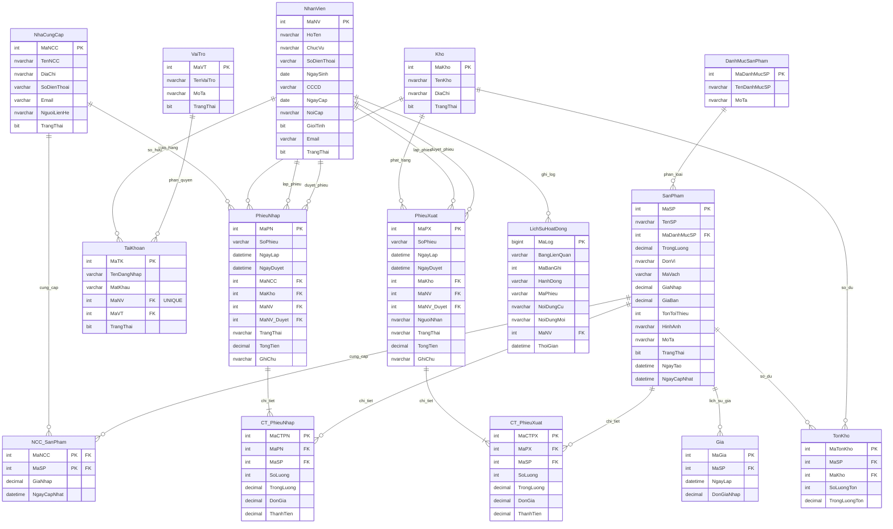
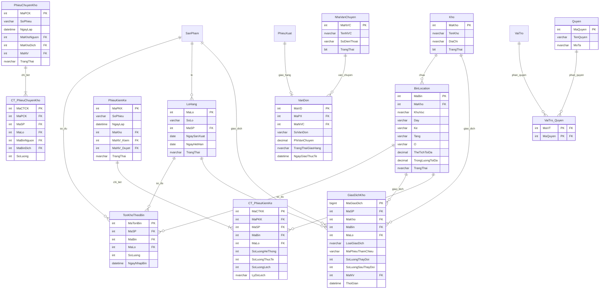

# Database Design – Quản Lý Hàng Tồn Kho (Demo vs Production)

Tài liệu này trình bày chi tiết thiết kế cơ sở dữ liệu của dự án IMS Logistics, bao gồm hai phiên bản:
1. **Database Demo (Học thuật - 15 Bảng):** Phục vụ chấm điểm đồ án, cài đặt đầy đủ các tính năng nâng cao của SQL Server (Trigger, Stored Procedure, Function, Cursor, Views, Index, Role & Permission, Backup & Restore).
2. **Database Production (Doanh nghiệp - WMS thực tế):** Phục vụ mở rộng vận hành logistics chuyên sâu (Layout kho, Lô hàng/Hạn dùng, Ledger giao dịch, RBAC) và chống tắc nghẽn (Deadlock).

---

## PHẦN 1: DATABASE DEMO (HỌC THUẬT - 15 BẢNG)

Đây là phiên bản cơ sở dữ liệu đã được đồng bộ hóa và nâng cấp khớp 100% với tài liệu báo cáo của nhóm và mã nguồn C# thực tế.

### 1. Sơ đồ Quan hệ Thực thể (ERD) - Database Demo

Sơ đồ thể hiện mối quan hệ giữa 15 bảng trong hệ thống Demo với cấu trúc bảng và các trường khóa ngoại chi tiết (tương tự giao diện Database Diagram của SQL Server Management Studio):

*Mã nguồn Mermaid để render sơ đồ:*

---

### 2. Chi Tiết Cấu Trúc Các Bảng (Demo Schema)

#### 2.1 Bảng `DanhMucSanPham` (Phân loại sản phẩm)
| Tên Cột | Kiểu Dữ Liệu | Ràng Buộc | Mô Tả |
| :--- | :--- | :--- | :--- |
| `MaDanhMucSP` | INT | PK, IDENTITY(1,1) | Mã danh mục tự tăng |
| `TenDanhMucSP` | NVARCHAR(100) | NOT NULL, UNIQUE | Tên danh mục duy nhất |
| `MoTa` | NVARCHAR(255) | NULL | Mô tả danh mục |

#### 2.2 Bảng `NhaCungCap` (Nhà cung cấp)
| Tên Cột | Kiểu Dữ Liệu | Ràng Buộc | Mô Tả |
| :--- | :--- | :--- | :--- |
| `MaNCC` | INT | PK, IDENTITY(1,1) | Mã nhà cung cấp |
| `TenNCC` | NVARCHAR(100) | NOT NULL | Tên công ty/nhà cung cấp |
| `DiaChi` | NVARCHAR(255) | NULL | Địa chỉ văn phòng |
| `SoDienThoai` | VARCHAR(20) | NULL | Số điện thoại liên lạc |
| `Email` | VARCHAR(100) | NULL | Địa chỉ email liên hệ |
| `NguoiLienHe` | NVARCHAR(100) | NULL | Tên người đại diện liên hệ |
| `TrangThai` | BIT | DEFAULT 1 | 1 = Đang hợp tác, 0 = Ngừng |

#### 2.3 Bảng `SanPham` (Danh mục mặt hàng kinh doanh)
| Tên Cột | Kiểu Dữ Liệu | Ràng Buộc | Mô Tả |
| :--- | :--- | :--- | :--- |
| `MaSP` | INT | PK, IDENTITY(1,1) | Mã sản phẩm |
| `TenSP` | NVARCHAR(200) | NOT NULL | Tên sản phẩm |
| `MaDanhMucSP` | INT | FK -> `DanhMucSanPham` | Liên kết danh mục |
| `TrongLuong` | DECIMAL(10,3) | CHECK >= 0, DEFAULT 0 | Trọng lượng đơn vị (kg) |
| `DonVi` | NVARCHAR(50) | NOT NULL | Đơn vị tính (Cái, Chai, Hộp...) |
| `MaVach` | VARCHAR(50) | UNIQUE, NULL | Mã vạch EAN/UPC |
| `GiaNhap` | DECIMAL(18,2) | CHECK >= 0, DEFAULT 0 | Giá nhập tham khảo mặc định |
| `GiaBan` | DECIMAL(18,2) | CHECK >= 0, DEFAULT 0 | Giá bán tham khảo mặc định |
| `TonToiThieu` | INT | DEFAULT 10 | Ngưỡng báo tồn thấp |
| `HinhAnh` | NVARCHAR(255) | NULL | Đường dẫn ảnh tĩnh |
| `MoTa` | NVARCHAR(255) | NULL | Mô tả sản phẩm |
| `TrangThai` | BIT | DEFAULT 1 | 1 = Đang kinh doanh |
| `NgayTao` | DATETIME | DEFAULT GETDATE() | Ngày chèn bản ghi |
| `NgayCapNhat` | DATETIME | DEFAULT GETDATE() | Ngày sửa bản ghi cuối |

#### 2.4 Bảng `NCC_SanPham` (Bảng giá nhập theo từng NCC - Quan hệ N-N)
| Tên Cột | Kiểu Dữ Liệu | Ràng Buộc | Mô Tả |
| :--- | :--- | :--- | :--- |
| `MaNCC` | INT | PK, FK -> `NhaCungCap` | Mã nhà cung cấp |
| `MaSP` | INT | PK, FK -> `SanPham` | Mã sản phẩm |
| `GiaNhap` | DECIMAL(18,2) | CHECK >= 0, DEFAULT 0 | Giá nhập cụ thể từ NCC này |
| `NgayCapNhat` | DATETIME | DEFAULT GETDATE() | Lần cập nhật giá gần nhất |

#### 2.5 Bảng `Kho` (Vị trí các kho vật lý)
| Tên Cột | Kiểu Dữ Liệu | Ràng Buộc | Mô Tả |
| :--- | :--- | :--- | :--- |
| `MaKho` | INT | PK, IDENTITY(1,1) | Mã kho hàng |
| `TenKho` | NVARCHAR(100) | NOT NULL | Tên kho hàng |
| `DiaChi` | NVARCHAR(300) | NULL | Địa chỉ vật lý của kho |
| `TrangThai` | BIT | DEFAULT 1 | 1 = Đang hoạt động |

#### 2.6 Bảng `NhanVien` (Nhân sự vận hành)
| Tên Cột | Kiểu Dữ Liệu | Ràng Buộc | Mô Tả |
| :--- | :--- | :--- | :--- |
| `MaNV` | INT | PK, IDENTITY(1,1) | Mã nhân viên |
| `HoTen` | NVARCHAR(100) | NOT NULL | Họ và tên nhân viên |
| `ChucVu` | NVARCHAR(50) | NULL | Chức vụ (Thủ kho, Quản lý...) |
| `SoDienThoai` | VARCHAR(20) | NULL | Số điện thoại |
| `NgaySinh` | DATE | NULL | Ngày sinh |
| `CCCD` | VARCHAR(12) | UNIQUE, NULL | Số CCCD (12 chữ số) |
| `NgayCap` | DATE | NULL | Ngày cấp CCCD |
| `NoiCap` | NVARCHAR(100) | NULL | Nơi cấp CCCD |
| `GioiTinh` | BIT | NULL | 1 = Nam, 0 = Nữ |
| `Email` | VARCHAR(100) | NULL | Email nội bộ |
| `TrangThai` | BIT | DEFAULT 1 | 1 = Đang làm việc |

#### 2.7 Bảng `VaiTro` (Vai trò phân quyền)
| Tên Cột | Kiểu Dữ Liệu | Ràng Buộc | Mô Tả |
| :--- | :--- | :--- | :--- |
| `MaVT` | INT | PK, IDENTITY(1,1) | Mã vai trò |
| `TenVaiTro` | NVARCHAR(50) | NOT NULL, UNIQUE | Tên vai trò (Admin, NVKho) |
| `MoTa` | NVARCHAR(200) | NULL | Mô tả quyền hạn |
| `TrangThai` | BIT | DEFAULT 1 | 1 = Đang sử dụng |

#### 2.8 Bảng `TaiKhoan` (Tài khoản đăng nhập hệ thống - Quan hệ 1-1 với nhân viên)
| Tên Cột | Kiểu Dữ Liệu | Ràng Buộc | Mô Tả |
| :--- | :--- | :--- | :--- |
| `MaTK` | INT | PK, IDENTITY(1,1) | Mã tài khoản |
| `TenDangNhap` | VARCHAR(50) | NOT NULL, UNIQUE | Tên đăng nhập |
| `MatKhau` | VARCHAR(256) | NOT NULL | Mật khẩu mã hóa SHA2_256 |
| `MaNV` | INT | FK -> `NhanVien`, UNIQUE | Nhân viên sở hữu (1-1) |
| `MaVT` | INT | FK -> `VaiTro` | Liên kết nhóm quyền |
| `TrangThai` | BIT | DEFAULT 1 | 1 = Đang hoạt động |

#### 2.9 Bảng `PhieuNhap` (Chứng từ nhập kho)
| Tên Cột | Kiểu Dữ Liệu | Ràng Buộc | Mô Tả |
| :--- | :--- | :--- | :--- |
| `MaPN` | INT | PK, IDENTITY(1,1) | Mã phiếu nhập |
| `SoPhieu` | VARCHAR(20) | UNIQUE | Mã số phiếu (PN-YYYY-NNNNN) |
| `NgayLap` | DATETIME | DEFAULT GETDATE() | Thời điểm lập phiếu |
| `NgayDuyet` | DATETIME | NULL | Thời điểm duyệt phiếu |
| `MaNCC` | INT | FK -> `NhaCungCap` | Nhà cung cấp giao hàng |
| `MaKho` | INT | FK -> `Kho` | Kho tiếp nhận hàng |
| `MaNV` | INT | FK -> `NhanVien` | Nhân viên lập phiếu |
| `MaNV_Duyet` | INT | FK -> `NhanVien`, NULL | Nhân viên nhấn duyệt phiếu |
| `TrangThai` | NVARCHAR(20) | CHECK (TrangThai), DEFAULT 'Nháp' | Nháp / ĐãDuyệt / ĐãHủy |
| `TongTien` | DECIMAL(18,2) | DEFAULT 0 | Tổng tiền (Trigger tự tính) |
| `GhiChu` | NVARCHAR(500) | NULL | Ghi chú thêm |

#### 2.10 Bảng `CT_PhieuNhap` (Chi tiết dòng hàng phiếu nhập)
| Tên Cột | Kiểu Dữ Liệu | Ràng Buộc | Mô Tả |
| :--- | :--- | :--- | :--- |
| `MaCTPN` | INT | PK, IDENTITY(1,1) | Mã chi tiết phiếu nhập |
| `MaPN` | INT | FK -> `PhieuNhap` (CASCADE) | Liên kết phiếu nhập |
| `MaSP` | INT | FK -> `SanPham` | Mã sản phẩm nhập |
| `SoLuong` | INT | CHECK > 0 | Số lượng nhập |
| `TrongLuong` | DECIMAL(10,3) | CHECK >= 0, NULL | Tổng trọng lượng dòng (Trigger tự tính) |
| `DonGia` | DECIMAL(18,2) | CHECK >= 0 | Đơn giá nhập thực tế |
| `ThanhTien` | DECIMAL(18,2) | AS (SoLuong * DonGia) PERSISTED | Thành tiền tự động tính toán |

#### 2.11 Bảng `PhieuXuat` (Chứng từ xuất kho)
| Tên Cột | Kiểu Dữ Liệu | Ràng Buộc | Mô Tả |
| :--- | :--- | :--- | :--- |
| `MaPX` | INT | PK, IDENTITY(1,1) | Mã phiếu xuất |
| `SoPhieu` | VARCHAR(20) | UNIQUE | Mã số phiếu (PX-YYYY-NNNNN) |
| `NgayLap` | DATETIME | DEFAULT GETDATE() | Thời điểm lập phiếu |
| `NgayDuyet` | DATETIME | NULL | Thời điểm duyệt phiếu |
| `MaKho` | INT | FK -> `Kho` | Kho phát hàng đi |
| `MaNV` | INT | FK -> `NhanVien` | Nhân viên lập phiếu |
| `MaNV_Duyet` | INT | FK -> `NhanVien`, NULL | Nhân viên nhấn duyệt phiếu |
| `NguoiNhan` | NVARCHAR(200) | NULL | Người hoặc đại lý nhận hàng |
| `TrangThai` | NVARCHAR(20) | CHECK (TrangThai), DEFAULT 'Nháp' | Nháp / ĐãDuyệt / ĐãHủy |
| `TongTien` | DECIMAL(18,2) | DEFAULT 0 | Tổng tiền xuất (Trigger tự tính) |
| `GhiChu` | NVARCHAR(500) | NULL | Ghi chú thêm |

#### 2.12 Bảng `CT_PhieuXuat` (Chi tiết dòng hàng phiếu xuất)
| Tên Cột | Kiểu Dữ Liệu | Ràng Buộc | Mô Tả |
| :--- | :--- | :--- | :--- |
| `MaCTPX` | INT | PK, IDENTITY(1,1) | Mã chi tiết phiếu xuất |
| `MaPX` | INT | FK -> `PhieuXuat` (CASCADE) | Liên kết phiếu xuất |
| `MaSP` | INT | FK -> `SanPham` | Mã sản phẩm xuất |
| `SoLuong` | INT | CHECK > 0 | Số lượng xuất |
| `TrongLuong` | DECIMAL(10,3) | CHECK >= 0, NULL | Tổng trọng lượng dòng (Trigger tự tính) |
| `DonGia` | DECIMAL(18,2) | CHECK >= 0 | Đơn giá xuất thực tế |
| `ThanhTien` | DECIMAL(18,2) | AS (SoLuong * DonGia) PERSISTED | Thành tiền tự động tính toán |

#### 2.13 Bảng `Gia` (Lịch sử biến động giá nhập)
| Tên Cột | Kiểu Dữ Liệu | Ràng Buộc | Mô Tả |
| :--- | :--- | :--- | :--- |
| `MaGia` | INT | PK, IDENTITY(1,1) | Mã bản ghi giá |
| `MaSP` | INT | FK -> `SanPham` | Mã sản phẩm |
| `NgayLap` | DATETIME | DEFAULT GETDATE() | Ngày ghi nhận (= Ngày duyệt phiếu nhập) |
| `DonGiaNhap` | DECIMAL(18,2) | CHECK >= 0 | Giá nhập tại thời điểm ghi nhận |

#### 2.14 Bảng `TonKho` (Bảng số dư tồn kho tĩnh theo từng kho)
| Tên Cột | Kiểu Dữ Liệu | Ràng Buộc | Mô Tả |
| :--- | :--- | :--- | :--- |
| `MaTonKho` | INT | PK, IDENTITY(1,1) | Mã tồn kho |
| `MaSP` | INT | FK -> `SanPham` | Mã sản phẩm |
| `MaKho` | INT | FK -> `Kho` | Kho chứa hàng |
| `SoLuongTon` | INT | CHECK >= 0, DEFAULT 0 | Số lượng tồn hiện có |
| `TrongLuongTon`| DECIMAL(12,3) | CHECK >= 0, DEFAULT 0 | Tổng trọng lượng tồn hiện có (kg) |
| `UNIQUE(MaSP, MaKho)` | | Ràng buộc duy nhất | Đảm bảo 1 sản phẩm chỉ có 1 dòng dư/kho |

#### 2.15 Bảng `LichSuHoatDong` (Nhật ký kiểm toán - Audit Trail)
| Tên Cột | Kiểu Dữ Liệu | Ràng Buộc | Mô Tả |
| :--- | :--- | :--- | :--- |
| `MaLog` | BIGINT | PK, IDENTITY(1,1) | Mã log (sử dụng BIGINT chống tràn) |
| `BangLienQuan` | VARCHAR(50) | NOT NULL | Tên bảng bị tác động |
| `MaBanGhi` | INT | NOT NULL | ID khóa chính dòng bị tác động |
| `HanhDong` | VARCHAR(10) | NOT NULL | INSERT / UPDATE / DELETE |
| `MaPhieu` | VARCHAR(20) | NULL | Số phiếu liên quan (nếu có) |
| `NoiDungCu` | NVARCHAR(MAX) | NULL | JSON dữ liệu cũ trước khi đổi |
| `NoiDungMoi` | NVARCHAR(MAX) | NULL | JSON dữ liệu mới sau khi đổi |
| `MaNV` | INT | FK -> `NhanVien`, NULL | Nhân viên thực hiện |
| `ThoiGian` | DATETIME | DEFAULT GETDATE() | Thời điểm phát sinh hành động |

---

### 3. Danh Sách Các Views (Demo vs Production)

#### 3.1 Các Views Trong CSDL Demo (9 Views thực tế đang chạy)
| # | Tên View | Mô Tả |
|---|---|---|
| 1 | `v_TonKhoHienTai` | JOIN `TonKho` + `SanPham` + `Kho` + `DanhMucSanPham`. Lấy thông tin tồn kho kèm giá trị tồn (`SoLuongTon * GiaNhap`). |
| 2 | `v_SanPhamDuoiTonToiThieu` | Tìm sản phẩm có số lượng tồn thấp hơn mức tối thiểu cảnh báo (`SoLuongTon < TonToiThieu`). |
| 3 | `v_NhapXuatTheoNgay` | Thống kê số lượng hàng nhập và xuất gom theo ngày (chỉ lọc phiếu `ĐãDuyệt`). Phục vụ vẽ biểu đồ xu hướng. |
| 4 | `v_ChiTietPhieuNhap` | JOIN đầy đủ thông tin phiếu nhập, nhà cung cấp, nhân viên lập/duyệt và chi tiết từng sản phẩm. |
| 5 | `v_ChiTietPhieuXuat` | JOIN đầy đủ thông tin phiếu xuất, kho, nhân viên lập/duyệt, người nhận và chi tiết từng sản phẩm xuất. |
| 6 | `v_DoanhThuTheoThang` | Thống kê tổng số phiếu xuất, tổng số lượng xuất và doanh thu xuất kho theo từng tháng. |
| 7 | `v_TopSanPhamXuatNhieu` | TOP 10 sản phẩm có tổng số lượng xuất kho nhiều nhất (ORDER BY số lượng giảm dần). |
| 8 | `v_PhieuGanDay` | UNION phiếu nhập và xuất gần nhất, lấy TOP 10 sắp xếp theo ngày lập giảm dần. |
| 9 | `v_ThongKeTongQuat` | Tổng hợp nhanh số lượng: sản phẩm, nhà cung cấp, kho, tổng giá trị tồn kho, số sản phẩm cảnh báo để hiển thị Dashboard. |

#### 3.2 Các Views Đề Xuất Cho CSDL Production (Phục vụ WMS chuyên sâu)
| # | Tên View | Mô Tả |
|---|---|---|
| 1 | `v_Prod_TonKhoThucTeTheoBin` | JOIN `TonKhoTheoBin`, `SanPham`, `BinLocation`, `LoHang` giúp thủ kho quét PDA biết chính xác sản phẩm nằm ở ô kệ nào và thuộc số lô nào. |
| 2 | `v_Prod_CanhBaoHanDung` | Lọc danh sách `LoHang` có ngày hết hạn cận kề (ví dụ: trong vòng 30 ngày) để bộ phận xử lý hàng cận date kịp thời xả hàng. |
| 3 | `v_Prod_PickingQueue` | Query danh sách hàng cần xuất được sắp xếp tối ưu theo nguyên tắc **FEFO** (First Expired First Out - Hàng hết hạn trước xuất trước). |
| 4 | `v_Prod_GoiYPutaway` | Tính toán thể tích và tải trọng khả dụng của từng `BinLocation` để hệ thống tự động gợi ý vị trí cất hàng tối ưu khi nhập kho. |

---

### 4. Các Hàm Phổ Biến - Functions (Demo vs Production)

#### 4.1 Các Functions Trong CSDL Demo (5 Functions thực tế đang chạy)
| # | Tên Hàm | Loại Hàm | Tham Số Đầu Vào | Mô Tả & Giá Trị Trả Về |
|---|---|---|---|---|
| 1 | `fn_TinhTonKho` | Scalar-valued | `@MaSP INT, @MaKho INT` | Trả về số lượng tồn kho (INT) của sản phẩm tại kho cụ thể. |
| 2 | `fn_TinhGiaTriTonKho` | Scalar-valued | `@MaKho INT` | Tính tổng giá trị tiền hàng đang lưu trữ tại kho (DECIMAL). |
| 3 | `fn_TinhGiaXuatBinhQuan` | Scalar-valued | `@MaSP INT` | Tính đơn giá xuất bình quan gia quyền của sản phẩm dựa trên lịch sử nhập hàng. |
| 4 | `fn_LayDanhSachSPTheoKho` | Table-valued | `@MaKho INT` | Trả về danh sách sản phẩm và số lượng tồn hiện có trong kho truyền vào. |
| 5 | `fn_TongNhapXuatTrongKy` | Table-valued | `@TuNgay DATE, @DenNgay DATE` | Tạo danh sách các ngày trong kỳ và tính tổng giá trị nhập/xuất tương ứng. |

#### 4.2 Các Functions Đề Xuất Cho CSDL Production (Phục vụ WMS chuyên sâu)
| # | Tên Hàm | Loại Hàm | Tham Số Đầu Vào | Mô Tả & Giá Trị Trả Về |
|---|---|---|---|---|
| 1 | `fn_Prod_TinhTheTichConLai` | Scalar-valued | `@MaBin INT` | Trả về thể tích trống còn lại của ô kệ (m3) sau khi trừ đi thể tích các sản phẩm hiện có. |
| 2 | `fn_Prod_TinhTrongLuongConLai`| Scalar-valued | `@MaBin INT` | Trả về tải trọng trống còn lại của kệ (kg) nhằm tránh đặt hàng quá tải gây gãy đổ kệ bãi. |

---

### 5. Thủ Tục Lưu Trữ - Stored Procedures (Demo vs Production)

#### 5.1 Các Stored Procedures Trong CSDL Demo (8 SPs thực tế đang chạy)
| # | Tên SP | Tham Số | Chức Năng |
|---|---|---|---|
| 1 | `sp_TaoPhieuNhap` | `@MaNCC, @MaKho, @MaNV, @GhiChu, @ChiTiet (Table-Valued Parameter)` | Tạo mới phiếu nhập và chi tiết phiếu nhập ở trạng thái 'Nháp' trong 1 transaction an toàn. |
| 2 | `sp_TaoPhieuXuat` | `@MaKho, @MaNV, @NguoiNhan, @GhiChu, @ChiTiet (Table-Valued Parameter)` | Tạo mới phiếu xuất kho ở trạng thái 'Nháp' trong 1 transaction. |
| 3 | `sp_DuyetPhieu` | `@LoaiPhieu VARCHAR(2), @MaPhieu INT, @MaNV INT` | Chuyển đổi trạng thái phiếu (PN hoặc PX) từ 'Nháp' sang 'ĐãDuyệt' và ghi nhận người duyệt. |
| 4 | `sp_HuyPhieu` | `@LoaiPhieu, @MaPhieu, @MaNV, @LyDo` | Hủy phiếu nhập/xuất. Hỗ trợ hoàn trả tồn kho nếu phiếu đó đã lỡ duyệt. |
| 5 | `sp_BaoCaoTonKho` | `@MaKho INT = NULL, @TuNgay DATE, @DenNgay DATE` | Xuất báo cáo tồn kho chi tiết gồm: Tồn đầu kỳ, Nhập trong kỳ, Xuất trong kỳ, Tồn cuối kỳ. |
| 6 | `sp_BaoCaoNhapTheoNCC` | `@MaNCC INT = NULL, @TuNgay DATE, @DenNgay DATE` | Chi tiết nhập kho theo nhà cung cấp trong khoảng thời gian đã chọn. |
| 7 | `sp_BaoCaoXuatTheoSP` | `@MaSP INT = NULL, @TuNgay DATE, @DenNgay DATE` | Thống kê lượng hàng xuất kho chi tiết theo từng sản phẩm. |
| 8 | `sp_DoiMatKhau` | `@MaTK INT, @MatKhauCu VARCHAR, @MatKhauMoi VARCHAR` | Xác thực mật khẩu cũ và tiến hành cập nhật mật khẩu mới cho tài khoản. |

#### 5.2 Các Stored Procedures Đề Xuất Cho CSDL Production (Phục vụ WMS chuyên sâu)
| # | Tên SP | Tham Số | Chức Năng |
|---|---|---|---|
| 1 | `sp_Prod_GhiGiaoDichKho` | `@MaSP, @MaKho, @MaBin, @MaLo, @LoaiGiaoDich, @SoLuongThayDoi, @MaNV` | Ghi nhận nhật ký dịch chuyển (Ledger Transaction) vào bảng `GiaoDichKho`. Đây là điểm cốt lõi để loại bỏ việc cập nhật ghi đè trực tiếp bảng tồn kho, ngăn ngừa hiện tượng **Deadlock** khi hàng trăm PDA cùng quét mã. |
| 2 | `sp_Prod_PutawayStock` | `@MaSP, @MaLo, @MaBin, @SoLuong, @MaNV` | Thực hiện quy trình cất hàng: kiểm tra tải trọng ô kệ -> gán hàng vào `BinLocation` -> ghi nhận giao dịch `GiaoDichKho` loại `NhapKho`. |
| 3 | `sp_Prod_KiemKeCuonChieu` | `@MaPKK, @MaBin, @MaSP, @MaLo, @SoLuongThucTe` | Thực hiện đối soát số liệu hệ thống và thực tế tại một vị trí kệ cụ thể, tự động tính chênh lệch và cập nhật Ledger điều chỉnh tồn kho. |

---

### 6. Danh Sách Triggers (Demo vs Production)

#### 6.1 Các Triggers Trong CSDL Demo (9 Triggers thực tế đang chạy)
1. `trg_CTPhieuNhap_TinhTrongLuong` (AFTER INSERT, UPDATE trên `CT_PhieuNhap`): Tự động tính trọng lượng chi tiết dòng nhập (`SoLuong * TrongLuongSP`).
2. `trg_CTPhieuXuat_TinhTrongLuong` (AFTER INSERT, UPDATE trên `CT_PhieuXuat`): Tự động tính trọng lượng chi tiết dòng xuất (`SoLuong * TrongLuongSP`).
3. `trg_CapNhatTongTien_PN` (AFTER INSERT, UPDATE, DELETE trên `CT_PhieuNhap`): Tự động cập nhật cột `TongTien` trong bảng `PhieuNhap` bằng tổng tiền các dòng chi tiết.
4. `trg_CapNhatTongTien_PX` (AFTER INSERT, UPDATE, DELETE trên `CT_PhieuXuat`): Tự động cập nhật cột `TongTien` trong bảng `PhieuXuat` bằng tổng tiền các dòng chi tiết.
5. `trg_TaoSoPhieu_PN` (AFTER INSERT trên `PhieuNhap`): Tự động sinh mã phiếu nhập theo định dạng chuỗi: `PN-YYYY-NNNNN`.
6. `trg_TaoSoPhieu_PX` (AFTER INSERT trên `PhieuXuat`): Tự động sinh mã phiếu xuất theo định dạng chuỗi: `PX-YYYY-NNNNN`.
7. `trg_ChanXoaSP_DaCoPhieu` (INSTEAD OF DELETE trên `SanPham`): Kiểm tra nếu sản phẩm đã phát sinh giao dịch thì cấm xóa để tránh lỗi mất liên kết dữ liệu lịch sử.
8. `trg_PhieuNhap_CapNhatTonKho` (AFTER UPDATE trên `PhieuNhap`):
   - Khi trạng thái chuyển sang **'ĐãDuyệt'**: Tự động cộng số lượng tồn, trọng lượng tồn vào bảng `TonKho` (UPSERT) và ghi nhận lịch sử giá nhập vào bảng `Gia`.
   - Khi trạng thái chuyển sang **'ĐãHủy'**: Kiểm tra tồn kho có đủ không, nếu đủ thì tự động trừ lại số lượng và trọng lượng đã nhập.
9. `trg_PhieuXuat_CapNhatTonKho` (AFTER UPDATE trên `PhieuXuat`):
   - Khi trạng thái chuyển sang **'ĐãDuyệt'**: Kiểm tra số lượng tồn kho hiện tại, nếu thiếu sẽ báo lỗi chặn giao dịch (RAISERROR), nếu đủ thì trừ số lượng và trọng lượng tồn kho tương ứng.
   - Khi trạng thái chuyển sang **'ĐãHủy'**: Tự động cộng trả lại số lượng và trọng lượng tồn kho đã trừ trước đó.

#### 6.2 Các Triggers Đề Xuất Cho CSDL Production (Phục vụ WMS chuyên sâu)
1. `trg_Prod_GiaoDichKho_AppendOnly` (INSTEAD OF UPDATE, DELETE trên `GiaoDichKho`): Cấm tuyệt đối việc sửa đổi hoặc xóa dữ liệu trong sổ cái giao dịch kho nhằm đảm bảo tính toàn vẹn 100% của lịch sử chuỗi cung ứng.
2. `trg_Prod_BinLocation_AutoStatus` (AFTER INSERT, UPDATE trên `TonKhoTheoBin`): Tự động cập nhật trạng thái ô kệ (`TrangThai` của `BinLocation`) thành 'Trong' (nếu số lượng = 0) hoặc 'DangSuDung' (nếu có hàng) nhằm định vị vị trí trống cho lượt cất hàng tiếp theo.

---

### 7. Cursors (2)

Để phục vụ yêu cầu sử dụng con trỏ (Cursor) duyệt dữ liệu tuần tự trong học thuật, hệ thống cài đặt 2 Cursors được wrap trong Stored Procedures:

1. `cur_CanhBaoTonToiThieu` (trong SP `sp_CursorCanhBaoTon`): 
   - **Mục đích**: Duyệt qua danh sách tồn kho của các sản phẩm đang dưới ngưỡng `TonToiThieu`.
   - **Hoạt động**: Sử dụng cursor duyệt từng dòng, tạo chuỗi cảnh báo chi tiết và in ra tab Message của SQL Server, đồng thời trả về bảng kết quả hiển thị lên giao diện Web.
2. `cur_TinhTonCuoiKy` (trong SP `sp_CursorTonCuoiKy`):
   - **Mục đích**: Tính toán số dư tồn kho cuối kỳ cho từng sản phẩm tại một hoặc tất cả các kho trong một khoảng thời gian chọn trước.
   - **Hoạt động**: Duyệt qua danh sách sản phẩm, tính toán tuần tự số dư đầu kỳ (dựa vào số dư hiện tại và lịch sử dịch chuyển), số lượng nhập/xuất trong kỳ để xuất ra kết quả tổng hợp chính xác.

---

### 8. Chỉ Mục Tối Ưu - Indexes (Demo vs Production)

#### 8.1 Các Indexes Trong CSDL Demo (7 Indexes thực tế đang chạy)
| # | Bảng | Cột Tạo Index | Loại Index | Lý Do Sử Dụng |
|---|---|---|---|---|
| 1 | `SanPham` | `TenSP` | NONCLUSTERED | Tối ưu hóa việc tìm kiếm sản phẩm theo tên trên thanh search. |
| 2 | `SanPham` | `MaVach` | NONCLUSTERED (Filtered) | Hỗ trợ quét mã vạch sản phẩm cực nhanh (lọc bỏ các giá trị NULL). |
| 3 | `PhieuNhap` | `NgayLap` | NONCLUSTERED | Tối ưu hóa việc lọc dữ liệu hóa đơn nhập theo ngày/tháng/năm. |
| 4 | `PhieuXuat` | `NgayLap` | NONCLUSTERED | Tối ưu hóa việc lọc dữ liệu hóa đơn xuất theo ngày/tháng/năm. |
| 5 | `TonKho` | `MaSP, MaKho` | UNIQUE | Đảm bảo mỗi sản phẩm chỉ có duy nhất một dòng số dư tại một kho hàng. |
| 6 | `CT_PhieuNhap` | `MaPN` | NONCLUSTERED | Tăng tốc độ truy vấn JOIN giữa bảng phiếu nhập và bảng chi tiết phiếu nhập. |
| 7 | `CT_PhieuXuat` | `MaPX` | NONCLUSTERED | Tăng tốc độ truy vấn JOIN giữa bảng phiếu xuất và bảng chi tiết phiếu xuất. |

#### 8.2 Các Indexes Đề Xuất Cho CSDL Production (Phục vụ WMS chuyên sâu)
| # | Bảng | Cột Tạo Index | Loại Index | Lý Do Sử Dụng |
|---|---|---|---|---|
| 1 | `TonKhoTheoBin` | `MaSP, MaBin` | NONCLUSTERED | Tăng tốc truy vấn tìm vị trí thực tế của một sản phẩm trong toàn kho bãi bận rộn. |
| 2 | `LoHang` | `MaSP, NgayHetHan` | NONCLUSTERED | Sắp xếp và lấy danh sách sản xuất cận hạn trước cực nhanh phục vụ nguyên tắc FEFO. |
| 3 | `GiaoDichKho` | `ThoiGian` | NONCLUSTERED (DESC) | Tăng tốc độ hiển thị và đối soát nhật ký hoạt động thời gian thực (Ledger History) của kho. |

---

### 9. An Toàn Thông Tin & Phân Quyền CSDL

Hệ thống bảo mật dữ liệu ở cả 2 cấp độ:

#### 9.1 Bảo mật dữ liệu & Xác thực
- **Mật khẩu tài khoản**: Được băm mã hóa một chiều bằng thuật toán mạnh `SHA2_256` trước khi lưu vào bảng `TaiKhoan` (sử dụng hàm `HASHBYTES` của SQL Server).
- **Sao lưu & Phục hồi (Backup & Restore)**:
  - SP `sp_BackupDatabase`: Thực hiện sao lưu dữ liệu toàn phần (Full Backup) ra tệp tin `.bak` kèm timestamp tự động.
  - SP `sp_RestoreDatabase` (chạy trên DB master): Chuyển database sang chế độ `SINGLE_USER` để ngắt toàn bộ kết nối hiện hành, tiến hành ghi đè dữ liệu phục hồi từ file `.bak` và đưa database trở lại chế độ `MULTI_USER`.

#### 9.2 Phân quyền Database (Roles & Permissions)
Thiết lập 2 Database Roles tương ứng với quyền hạn thực tế trong kho:
1. **`db_ims_admin`**: Được gán toàn quyền quản lý, thêm, sửa, xóa, duyệt phiếu trên toàn bộ database.
2. **`db_ims_nvkho`**: 
   - Chỉ được gán quyền `SELECT` đọc thông tin.
   - Được gán quyền `EXECUTE` để thực thi các Stored Procedures nghiệp vụ (như tạo phiếu, duyệt phiếu, đổi mật khẩu, chạy báo cáo).
   - **DENY** trực tiếp quyền thao tác dữ liệu thủ công (`INSERT, UPDATE, DELETE`) trên các bảng cốt lõi như `TonKho`, `PhieuNhap`, `PhieuXuat` để bắt buộc mọi hoạt động thay đổi số lượng hàng hóa đều phải đi qua Stored Procedures/Triggers kiểm soát nghiệp vụ.

---

## PHẦN 2: DATABASE PRODUCTION (ENTERPRISE WMS - GO-LIVE)

Đây là bản thiết kế CSDL doanh nghiệp nâng cao được đề xuất mở rộng để đáp ứng trọn vẹn quy trình vận hành logistics thực tế (như Smartlog SWM) và chịu tải cao.

### 1. Sơ đồ Quan hệ Thực thể (ERD) - Database Production

Sơ đồ thể hiện mối quan hệ giữa các bảng trong hệ thống WMS Production mở rộng với cấu trúc bảng và các trường khóa ngoại chi tiết:

*Mã nguồn Mermaid để render sơ đồ:*

---

### 2. Các Bảng Dữ Liệu Mở Rộng Cho Hệ Thống Go-Live

#### 2.1 Bảng `BinLocation` (Quản lý chi tiết layout kho - Row, Rack, Shelf, Bin)
Giúp thủ kho quét barcode PDA định vị vị trí chính xác của từng kiện hàng.
- `MaBin` (INT PK, IDENTITY): Mã định danh vị trí ô kệ.
- `MaKho` (INT FK -> `Kho`): Kho chứa vị trí này.
- `KhuVuc` (NVARCHAR(50)): Zone (Ví dụ: Khu mát, Khu thường, Zone A...).
- `Day` (VARCHAR(10)): Dãy kệ (Row).
- `Ke` (VARCHAR(10)): Kệ chứa (Rack).
- `Tang` (VARCHAR(10)): Tầng kệ (Shelf).
- `O` (VARCHAR(10)): Ô chứa hàng cụ thể (Bin).
- `TheTichToiDa` (DECIMAL(10,2)): Dung tích tối đa của ô kệ (m3).
- `TrongLuongToiDa` (DECIMAL(10,2)): Tải trọng tối đa cho phép (kg).
- `TrangThai` (NVARCHAR(20)): Trống (Trong) / DangSuDung / Khoa (Bảo trì).

#### 2.2 Bảng `LoHang` (Quản lý Lô & Hạn sử dụng - Hỗ trợ FEFO/FIFO)
Quản lý các mặt hàng thực phẩm, dược phẩm cần theo dõi date nghiêm ngặt để tránh thất thoát do quá hạn.
- `MaLo` (INT PK, IDENTITY): Mã định danh lô hàng.
- `SoLo` (VARCHAR(50) NOT NULL UNIQUE): Số lô nhà sản xuất (Batch/Lot Number).
- `MaSP` (INT FK -> `SanPham`): Sản phẩm thuộc lô này.
- `NgaySanXuat` (DATE): Ngày sản xuất.
- `NgayHetHan` (DATE NOT NULL): Hạn sử dụng bắt buộc.
- `TrangThai` (NVARCHAR(20)): KhaDung / ChoKiemDinh / HetHan / Khoa.

#### 2.3 Bảng `TonKhoTheoBin` (Tồn kho thực tế phân mảnh theo vị trí và lô)
Quản lý vị trí thực tế của từng thùng hàng.
- `MaTonBin` (INT PK, IDENTITY): Khóa chính.
- `MaSP` (INT FK -> `SanPham`): Mã sản phẩm.
- `MaBin` (INT FK -> `BinLocation`): Mã ô kệ.
- `MaLo` (INT FK -> `LoHang`): Mã lô hàng.
- `SoLuong` (INT CHECK >= 0): Số lượng tồn thực tế tại ô kệ và lô này.
- `NgayNhapBin` (DATETIME): Ngày cất hàng lên kệ (Putaway Date).

#### 2.4 Bảng `GiaoDichKho` (Inventory Transaction Ledger - Sổ cái giao dịch kho)
Thay thế trigger cập nhật trực tiếp bảng tĩnh để tránh **Deadlock** khi chịu tải cao.
- `MaGiaoDich` (BIGINT PK, IDENTITY): Mã giao dịch tự tăng (BIGINT).
- `MaSP` (INT FK -> `SanPham`): Mã sản phẩm.
- `MaKho` (INT FK -> `Kho`): Mã kho hàng.
- `MaBin` (INT FK -> `BinLocation`): Mã ô kệ.
- `MaLo` (INT FK -> `LoHang`): Mã lô hàng.
- `LoaiGiaoDich` (NVARCHAR(30)): NhapKho / XuatKho / ChuyenBin / KiemKe.
- `MaPhieuThamChieu` (VARCHAR(30)): Số phiếu (PN-..., PX-..., KK-...).
- `SoLuongThayDoi` (INT): Lượng thay đổi (+ hoặc -).
- `SoLuongSauThayDoi` (INT): Số lượng tồn sau thay đổi (phục vụ đối soát).
- `MaNV` (INT FK -> `NhanVien`): Nhân viên quét mã PDA thực hiện.
- `ThoiGian` (DATETIME): Thời gian chính xác đến mili giây.

#### 2.5 Bảng `PhieuKiemKe` & `CT_PhieuKiemKe` (Kiểm kê cuốn chiếu)
Quản lý quy trình kiểm kê định kỳ, tự động đối chiếu số liệu đếm thực tế và tồn sổ sách.
- `PhieuKiemKe` (`MaPKK` INT PK, `SoPhieu` VARCHAR(20) UNIQUE, `NgayLap` DATETIME, `MaKho` INT FK, `MaNV_Kiem` INT FK, `MaNV_Duyet` INT FK, `TrangThai` NVARCHAR(20) [Nhap/ChoDuyet/DaDuyet/DaHuy]).
- `CT_PhieuKiemKe` (`MaCTKK` INT PK, `MaPKK` INT FK, `MaSP` INT FK, `MaBin` INT FK, `MaLo` INT FK, `SoLuongHeThong` INT, `SoLuongThucTe` INT, `SoLuongLech` AS (`SoLuongThucTe - SoLuongHeThong`), `LyDoLech` NVARCHAR(255)).

#### 2.6 Bảng `PhieuChuyenKho` & `CT_PhieuChuyenKho` (Điều chuyển kho hàng nội bộ)
- `PhieuChuyenKho` (`MaPCK` INT PK, `SoPhieu` VARCHAR(20) UNIQUE, `NgayLap` DATETIME, `MaKhoNguon` INT FK, `MaKhoDich` INT FK, `MaNV` INT FK, `TrangThai` NVARCHAR(20) [ChoXuat/DaXuat/DaNhan]).
- `CT_PhieuChuyenKho` (`MaCTCK` INT PK, `MaPCK` INT FK, `MaSP` INT FK, `MaLo` INT FK, `MaBinNguon` INT FK, `MaBinDich` INT FK, `SoLuong` INT).

#### 2.7 Bảng `NhaVanChuyen` & `VanDon` (Quản lý Vận tải & Giao nhận hàng đầu ra)
- `NhaVanChuyen` (`MaNVC` INT PK, `TenNVC` NVARCHAR(100), `SoDienThoai` VARCHAR(20), `TrangThai` BIT).
- `VanDon` (`MaVD` INT PK, `MaPX` INT FK, `MaNVC` INT FK, `SoVanDon` VARCHAR(50) UNIQUE, `PhiVanChuyen` DECIMAL(18,2), `TrangThaiGiaoHang` NVARCHAR(30) [ChoGiao/DangGiao/ThanhCong/ChuyenHoan], `NgayGiaoThucTe` DATETIME).

#### 2.8 Bảng `Quyen` & `VaiTro_Quyen` (Hệ thống phân quyền RBAC động chi tiết)
- `Quyen` (`MaQuyen` INT PK, `TenQuyen` VARCHAR(50) UNIQUE, `MoTa` NVARCHAR(200)) -> *Ví dụ: TaoPhieuNhap, DuyetPhieuXuat, KiemKeKho, BaoCaoDoanhThu*.
- `VaiTro_Quyen` (`MaVT` INT FK, `MaQuyen` INT FK, PK[`MaVT`, `MaQuyen`]).

---

## PHẦN 3: SO SÁNH GIẢI PHÁP THIẾT KẾ (DEMO VS PRODUCTION)

| Tiêu Chí | Database Demo (Học thuật) | Database Production (Vận hành) |
| :--- | :--- | :--- |
| **Kiến trúc số dư** | Bảng phẳng tĩnh `TonKho`. Cập nhật ghi đè giá trị số lượng trực tiếp. | Mô hình **Stock Ledger (Sổ cái)**. Số lượng tồn hiện tại = SUM của tất cả giao dịch trong lịch sử. |
| **Quản lý vị trí** | Chỉ quản lý ở mức kho chung chung (`MaKho`). Không biết sản phẩm để ở đâu. | Quản lý chi tiết tới cấp ô kệ (`BinLocation`: Row, Rack, Shelf, Bin). Gợi ý Putaway/Picking. |
| **Quản lý Hạn dùng** | Không theo dõi hạn dùng. Không quản lý lô. | Theo dõi chặt chẽ hạn dùng theo từng `LoHang`, áp dụng xuất hàng cận hạn trước (**FEFO**). |
| **Cơ chế thay đổi tồn** | Dùng **Triggers** trong SQL Server (AFTER/INSTEAD OF). Tự động cập nhật cột số dư. | **Event-driven / Ledger Transactions** (Append-only). Ghi dòng mới vào `GiaoDichKho` (INSERT). |
| **Kiểm soát nghẽn (Deadlock)** | Dễ xảy ra deadlock và nghẽn hệ thống khi hàng trăm thiết bị quét mã đồng thời khóa bảng `TonKho`. | Chống deadlock tuyệt đối bằng thao tác INSERT nối đuôi (no rowlock conflict) kết hợp khóa bi quan ở mức nghiệp vụ. |
| **Truy vết thất thoát** | Chỉ ghi nhận log thao tác thô ở bảng `LichSuHoatDong`. Khó kiểm tra chênh lệch. | Ghi nhận chi tiết từng lần dịch chuyển, kiểm kho cuốn chiếu, phát hiện lệch và lưu vết 100%. |
