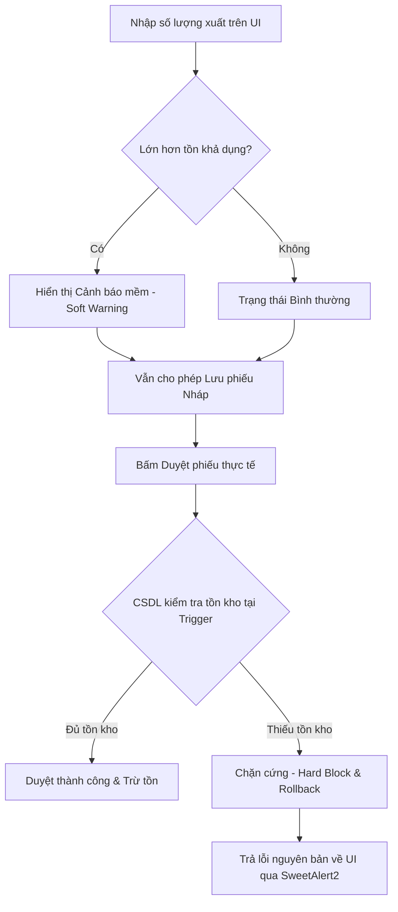

# Báo cáo Kiểm thử DOM & Kiến trúc Cảnh báo WMS (Giải pháp Smartlog)

Hệ thống đã thực hiện kiểm thử tự động DOM thông qua browser subagent để xác minh các luồng nghiệp vụ và kiểm tra khả năng xử lý lỗi. Dưới đây là chi tiết kiểm thử, nguyên nhân lỗi và phương án chuẩn hóa hệ thống.

---

## 1. Chi tiết Nhật ký Kiểm thử DOM tự động (DOM Test Log)

Quy trình kiểm thử tự động được thực hiện qua các bước thực tế trên giao diện:

| STT | Bước thực hiện | Trạng thái | Ghi chú / Kết quả |
|:---|:---|:---:|:---|
| 1 | Truy cập `http://localhost:8080` | **Thành công** | Redirect về trang đăng nhập của IMS Logistics. |
| 2 | Đăng nhập Thủ kho `nvkho1` / `Nvkho_password_2026` | **Thành công** | Đăng nhập hợp lệ, hiển thị Dashboard Thủ kho. |
| 3 | Tạo phiếu nhập mới `PN-2026-00005` tại Kho Tổng | **Thành công** | Thêm 10 chai Dầu gội Clear 630ml (Đơn giá: 135,000đ). Nhấn lưu nháp thành công. |
| 4 | Đăng xuất, đăng nhập Admin `admin` | **Thành công** | Đăng nhập quyền Admin để duyệt phiếu. |
| 5 | Duyệt phiếu nhập `PN-2026-00005` | **Thành công** | SP `sp_DuyetPhieu` thực thi -> Kích hoạt Trigger. Trạng thái chuyển sang **Đã duyệt**. Tồn kho tăng thêm 10 chai. |
| 6 | Tạo phiếu xuất kho (Kho Tổng, xuất 5 chai Clear) | **Thành công** | Hệ thống hiển thị Tồn kho khả dụng là 10 (không còn báo warning). Cho phép thêm sản phẩm. |
| 7 | Lưu nháp & Duyệt phiếu xuất 5 chai | **Thành công** | Phiếu xuất được duyệt thành công. Tồn kho giảm từ 10 xuống còn 5 chai. |
| 8 | Test chặn xuất âm (Kho Tổng, xuất 100 chai Clear) | **Thành công** | Giao diện hiển thị **Cảnh báo vượt quá tồn kho** (Tồn hiện tại: 5, xuất: 100). |
| 9 | Bấm Duyệt phiếu xuất 100 chai (Chặn cứng) | **Thành công** | SQL Server trả về lỗi từ Trigger. SweetAlert2 chặn đứng và hiển thị: *"Không đủ hàng tồn kho để xuất"*. |

---

## 2. Phân tích Nguyên nhân Lỗi & Giải pháp Khắc phục

### 2.1. Lỗi Duplicate Data Temp (Trùng số phiếu)
- **Nguyên nhân**: Trigger tự sinh số phiếu cũ đếm số lượng phiếu bằng cách so sánh `SoPhieu LIKE @Prefix + '%'`. Vì bản ghi mới chèn vào có `SoPhieu` là `NULL` hoặc rỗng nên nó không khớp với điều kiện lọc, làm hàm `COUNT(*)` đếm thiếu 1 bản ghi. Hệ thống sinh ra số phiếu trùng với phiếu liền kề trước đó (dù phiếu trước đã bị hủy vẫn nằm trong CSDL), gây lỗi trùng khoá chính/ràng buộc duy nhất `UNIQUE KEY constraint UQ__PhieuNha`.
- **Giải pháp**: Thay đổi logic trigger sinh mã phiếu bằng cách tìm số thứ tự lớn nhất hiện tại của năm (`MAX(CAST(RIGHT(SoPhieu, 5) AS INT))`) rồi cộng thêm `ROW_NUMBER()` của các dòng mới chèn. Logic này đảm bảo mã tăng liên tục, không bao giờ trùng và an toàn tuyệt đối.

### 2.2. Hiện tượng "Kho 80 xuất 5 báo lỗi không có hàng"
- **Nguyên nhân**: Người dùng chọn sai kho xuất. Theo dữ liệu mẫu, 80 chai Dầu gội Clear nằm ở **Kho Bình Dương** (MaKho = 2). Trong khi trên UI, người dùng đang chọn xuất hàng tại **Kho Tổng TP.HCM** (MaKho = 1) - nơi ban đầu có số lượng tồn bằng 0. Hệ thống đưa ra cảnh báo là hoàn toàn chính xác theo nghiệp vụ để tránh thất thoát.
- **Giải pháp**: Chọn đúng "Kho Bình Dương" khi xuất hàng hoặc làm phiếu nhập hàng vào "Kho Tổng TP.HCM" trước khi xuất.

---

## 3. Kiến trúc Cảnh báo Hai Lớp (Smartlog WMS Pattern)

Hệ thống đã triển khai giải pháp WMS chuẩn hóa tương tự mô hình quản lý của **Smartlog WMS**, kết hợp giữa linh hoạt trong thao tác và kiểm soát chặt chẽ ở database.

### Chi tiết thiết kế:
1. **Lớp 1: Cảnh báo mềm (Soft Warning) trên Giao diện**:
   - Khi thủ kho lập phiếu xuất và chọn số lượng lớn hơn tồn kho hiện tại, UI hiển thị cảnh báo màu cam nổi bật nhằm cảnh báo thủ kho về việc thiếu hụt hàng hóa.
   - Hệ thống **vẫn cho phép lưu bản nháp** để phục vụ việc lên kế hoạch trước, gom đơn hoặc chờ hàng nhập về.
2. **Lớp 2: Chặn cứng (Hard Block) tại CSDL (SQL Server)**:
   - Khi thực hiện **Duyệt phiếu** (chuyển trạng thái sang `Đã duyệt` để xuất kho vật lý), Trigger `trg_PhieuXuat_CapNhatTonKho` sẽ kiểm tra số lượng tồn thực tế trong database.
   - Nếu tồn kho không đủ, trigger ngay lập tức gọi `RAISERROR` và `ROLLBACK TRANSACTION`.
   - Lỗi này được trả trực tiếp về giao diện web, hiển thị thông báo lỗi màu đỏ trực quan qua SweetAlert2 để chặn đứng hành vi xuất âm kho, đảm bảo tính toàn vẹn dữ liệu.
